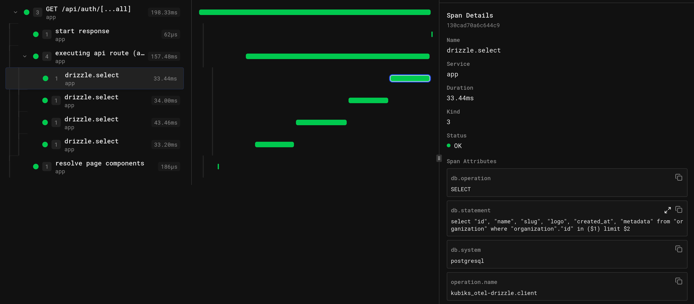

# @kubiks/otel-drizzle

OpenTelemetry instrumentation for [Drizzle ORM](https://orm.drizzle.team/). Add distributed tracing to your database queries with a single line of code.



*Visualize your database queries with detailed span information including operation type, SQL statements, and performance metrics.*

## Installation

```bash
npm install @kubiks/otel-drizzle
# or
pnpm add @kubiks/otel-drizzle
# or
yarn add @kubiks/otel-drizzle
```

**Peer Dependencies:** `@opentelemetry/api` >= 1.9.0, `drizzle-orm` >= 0.28.0

## Usage

Simply wrap your Drizzle client with `instrumentDrizzle()`:

```typescript
import { drizzle } from "drizzle-orm/node-postgres";
import { Pool } from "pg";
import { instrumentDrizzle } from "@kubiks/otel-drizzle";

const pool = new Pool({ connectionString: process.env.DATABASE_URL });
const db = instrumentDrizzle(drizzle(pool));

// That's it! All queries are now traced automatically
const users = await db.select().from(usersTable);
```

### Optional Configuration

```typescript
instrumentDrizzle(db, {
  dbSystem: "postgresql", // Database type (default: 'postgresql')
  dbName: "myapp", // Database name for spans
  captureQueryText: true, // Include SQL in traces (default: true)
  maxQueryTextLength: 1000, // Max SQL length (default: 1000)
});
```

### Works with Any Database

```typescript
// PostgreSQL
import { drizzle } from "drizzle-orm/node-postgres";
const db = instrumentDrizzle(drizzle(pool));

// MySQL
import { drizzle } from "drizzle-orm/mysql2";
const db = instrumentDrizzle(drizzle(connection), { dbSystem: "mysql" });

// SQLite
import { drizzle } from "drizzle-orm/better-sqlite3";
const db = instrumentDrizzle(drizzle(sqlite), { dbSystem: "sqlite" });
```

## What You Get

Each database query automatically creates a span with rich telemetry data:

- **Span name**: `drizzle.select`, `drizzle.insert`, `drizzle.update`, etc.
- **Operation type**: `db.operation` attribute (SELECT, INSERT, UPDATE, DELETE)
- **SQL query text**: Full query statement captured in `db.statement` (configurable)
- **Database system**: `db.system` attribute (postgresql, mysql, sqlite, etc.)
- **Error tracking**: Exceptions are recorded with stack traces and proper span status
- **Performance metrics**: Duration and timing information for every query

### Span Attributes

The instrumentation adds the following attributes to each span following [OpenTelemetry semantic conventions](https://opentelemetry.io/docs/specs/semconv/database/):

| Attribute | Description | Example |
|-----------|-------------|---------|
| `db.operation` | SQL operation type | `SELECT` |
| `db.statement` | Full SQL query | `select "id", "name" from "users"...` |
| `db.system` | Database system | `postgresql` |
| `db.name` | Database name | `myapp` |
| `operation.name` | Client operation name | `kubiks_otel-drizzle.client` |

## License

MIT
